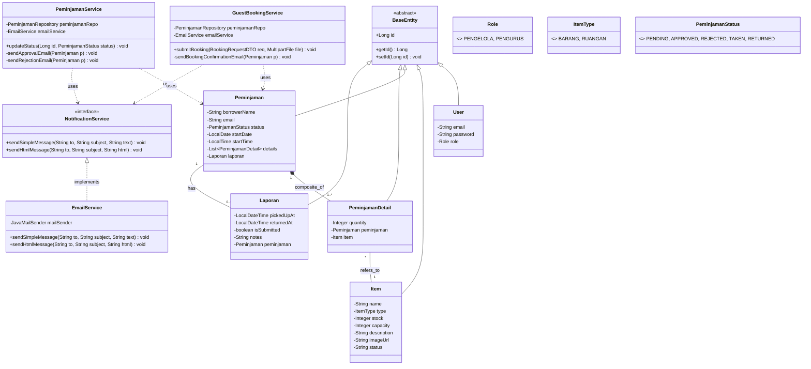

# 📘 Dokumentasi Lengkap Sistem Inventaris MSU

Dokumen ini merupakan **Panduan Utama** yang menggabungkan seluruh aspek teknis dan operasional sistem Inventaris MSU, mulai dari cara instalasi, alur penggunaan website, arsitektur backend, hingga spesifikasi API.

---

## 📑 Daftar Isi

1.  **[BAB 1: Cara Deployment & Instalasi](#bab-1-cara-deployment--instalasi)**
2.  **[BAB 2: Alur Website (User Guide)](#bab-2-alur-website-user-guide)**
3.  **[BAB 3: Arsitektur Backend & Keamanan](#bab-3-arsitektur-backend--keamanan)**
    *   *Termasuk Class Diagram & Relasi Entity*
4.  **[BAB 4: Dokumentasi API](#bab-4-dokumentasi-api)**

---

## BAB 1: Cara Deployment & Instalasi

Panduan ini langkah-langkah untuk menjalankan aplikasi **Inventaris MSU** menggunakan Docker Compose. Pastikan Anda sudah menginstall **Docker Desktop** atau **Docker Engine** dan **Git** sebelum memulai.

### 1. Persiapan

1.  **Clone Repository**
    Buka terminal dan clone repository ini:
    ```bash
    git clone https://github.com/Kruwpuck/Inventaris-MSU-PBO.git
    cd Inventaris-MSU-PBO/InventarisMSU
    ```

2.  **Struktur Docker**
    Aplikasi ini terdiri dari 4 layanan (service) yang akan berjalan secara bersamaan:
    *   **inventaris-app**: Aplikasi Backend & Frontend (Spring Boot) berjalan di port internal 8080.
    *   **inventaris-db**: Database MySQL 8.0.
    *   **inventaris-phpmyadmin**: Interface database visual (akses via port 8081).
    *   **inventaris-nginx**: Reverse proxy yang mengekspos aplikasi di port 80.

### 2. Menjalankan Aplikasi

Jalankan perintah berikut di dalam folder `InventarisMSU` (di mana file `compose.yaml` berada):

```bash
docker compose up -d --build
```

**Penjelasan Perintah:**
*   `up`: Menjalankan container.
*   `-d`: Detached mode (berjalan di background).
*   `--build`: Memaksa build ulang image aplikasi agar perubahan kode terbaru diterapkan.

Tunggu hingga proses build selesai. Ini mungkin memakan waktu beberapa menit tergantung kecepatan internet.

### 3. Akses Aplikasi

| Layanan | URL | Keterangan |
| :--- | :--- | :--- |
| **Website Utama** | [http://localhost](http://localhost) | Portal Peminjaman (Guest & Admin) |
| **phpMyAdmin** | [http://localhost:8081](http://localhost:8081) | Manajemen Database MySQL |
| **API Endpoint** | [http://localhost:8080](http://localhost:8080) | Akses langsung ke Spring Boot (Opsional) |

### 4. Troubleshooting & Konfigurasi

*   **Cek Status**: `docker ps`
*   **Lihat Logs**: `docker logs -f inventaris-app`
*   **Stop**: `docker compose down`

File konfigurasi utama terletak di `src/main/resources/application.yaml`. Anda dapat mengubah konfigurasi database atau email di sana (jangan lupa build ulang jika diubah).

---

## BAB 2: Alur Website (User Guide)

Website ini dirancang untuk memfasilitasi peminjaman barang dan ruangan di Masjid Syamsul Ulum (MSU) secara online. Berikut adalah alur penggunaan aplikasi untuk **Guest (Peminjam)** dan **Pengelola (Admin)**.

### A. Alur Peminjam (Guest)

1.  **Halaman Utama (Landing Page)**
    *   Akses: `http://localhost/`
    *   Pengguna melihat informasi umum, item unggulan, dan navigasi.

2.  **Katalog & Pencarian**
    *   Halaman Barang: `http://localhost/catalogue`
    *   Halaman Ruangan: `http://localhost/ruangan`
    *   Pengguna dapat mencari barang/ruangan, memfilter berdasarkan tanggal/waktu untuk melihat ketersediaan stok secara *real-time*.

3.  **Proses Booking (Keranjang)**
    *   Pengguna memilih item dengan tombol `+`. Item masuk ke keranjang belanja (floating cart).
    *   Klik tombol Checkout (ikon tas) untuk melanjutkan.

4.  **Formulir Peminjaman**
    *   Akses: `http://localhost/form`
    *   Pengguna mengisi data diri lengkap:
        *   Nama, Email, No HP, NIM/NIP, Unit/Departemen, Tujuan.
        *   **Identitas (KTM/KTP)** & **Surat Permohonan**: Wajib upload file gambar/PDF.
    *   Sistem memvalidasi durasi dan stok sebelum submit.

5.  **Submit & Konfirmasi**
    *   Setelah klik "Kirim Permohonan", data terkirim ke server.
    *   **Email Konfirmasi**: Peminjam otomatis menerima email konfirmasi bahwa permohonan telah diterima (Status: *PENDING*).

### B. Alur Pengelola (Admin Approval)

1.  **Login**: Akses `http://localhost/login` sebagai **Pengelola**.
2.  **Persetujuan (Approval)**:
    *   Akses menu "Daftar Permohonan".
    *   **Approve**: Stok dibooking, status jadi *APPROVED*, lanjut ke tahap penyerahan.
    *   **Reject**: Wajib isi alasan, status jadi *REJECTED*, stok dikembalikan. Notifikasi email dikirim ke peminjam.

### C. Alur Pengurus (Penyerahan & Pengembalian)

Setelah permohonan disetujui, proses berlanjut ke **Pengurus** di lapangan.

1.  **Penyerahan Barang**: Saat peminjam datang, Pengurus klik **"Sudah Ambil"** (Status *TAKEN*).
2.  **Pengembalian Barang**: Saat barang kembali, Pengurus klik **"Sudah Kembali"** (Status *COMPLETED*). Stok otomatis bertambah kembali.

---

## BAB 3: Arsitektur Backend & Keamanan

### 1. Implementasi Fungsionalitas Utama

**✅ Fitur & Clean Code**
Aplikasi dibangun di atas framework **Spring Boot 3** dengan prinsip **OOP** dan **MVC**:
*   **Model**: Entity JPA (Data).
*   **Repository**: Data Access Layer (DAO).
*   **Service**: Business Logic Layer.
*   **Controller**: API & HTTP Handling.

### 2. Class Diagram & Relasi Entity

Berikut adalah struktur Class Diagram sistem yang menggambarkan relasi antar Entity (Model) dan Service.



### 3. Penggunaan Teknologi

*   **Core**: Java 17 + Spring Boot 3.5.7, Maven
*   **Security**: Spring Security 6 (BCrypt, Role-Based Access Control)
*   **Database**: MySQL 8.0 (Dockerized)
*   **Frontend**: Thymeleaf (Server-Side)
*   **Mail Service**: Mailtrap

### 4. Integrasi Database & Keamanan

*   **CRUD & Transaksi**: Semua operasi tulis database dibungkus `@Transactional`.
*   **SQL Injection**: **KEBAL**. Menggunakan Prepared Statements via Spring Data JPA. Input user tidak pernah dieksekusi mentah.
*   **XSS**: Output HTML di-escape otomatis oleh Thymeleaf.
*   **Password**: Disimpan ter-hash menggunakan **BCrypt** (salted).

---

## BAB 4: Dokumentasi API

### 📦 Peminjaman Publik (Guest)

**1. Cek Stok (Real-time)**
*   `GET /api/peminjaman/check?startDate=...&startTime=...`
*   Response: JSON List Item + Available Stock.

**2. Submit Booking**
*   `POST /api/peminjaman` (Multipart)
*   Params: `borrowerName`, `items` (JSON), `file` (PDF), dll.

### 🛒 Cart (Keranjang)

**1. Add to Cart**
*   `POST /api/cart/add`
*   Body: `{ "name": "Kursi", "quantity": 5 }`

### 🔐 Pengelola & Pengurus

**1. Update Status (Admin)**
*   `POST /pengelola/approval/update`
*   Param: `id`, `action` (APPROVED/REJECTED), `reason`

**2. Update Status (Lapangan)**
*   `POST /pengurus/fasilitas/update-status`
*   Param: `id`, `action` (TAKEN/RETURNED)
